# The Voxelbound Expedition

*A survival session played end to end, one screenshot per beat. Every figure quoted under a picture was read out of the live game at the moment the shutter fell.*

## 1. Landfall

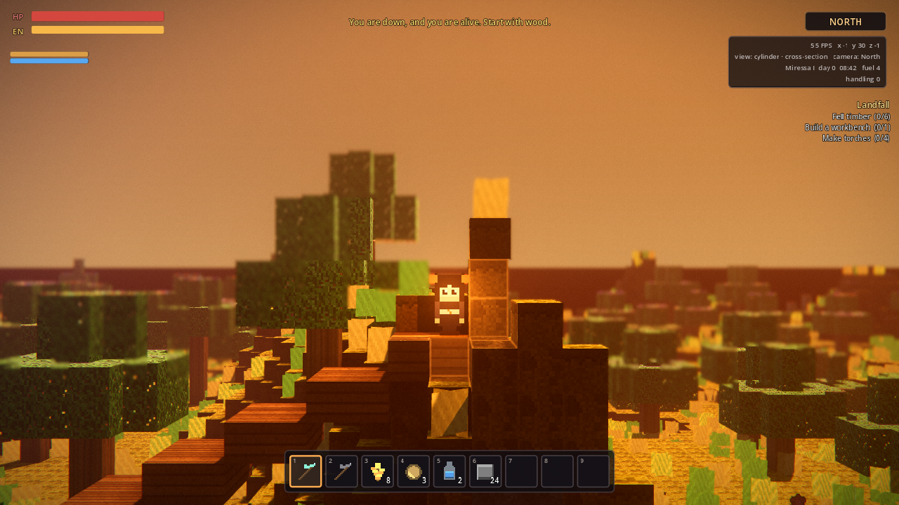

Down on Miressa I. The escape pod put me on a savannah at -1, -1, with the column top four blocks under my boots and nothing hostile in earshot. The survey lists 6 creatures native to this ground:

- Batong
- Lumoth
- Oculob
- Poptop
- Snaunt
- Yokat

Every one of them is on the list to be tamed before this is over.

> day 0, 08:42 · standing at -1 30 -1 · 100 hp · handling 0 · 0 mined, 0 placed, 0 crafted, 0 tamed

## 2. The cross-section, first thing

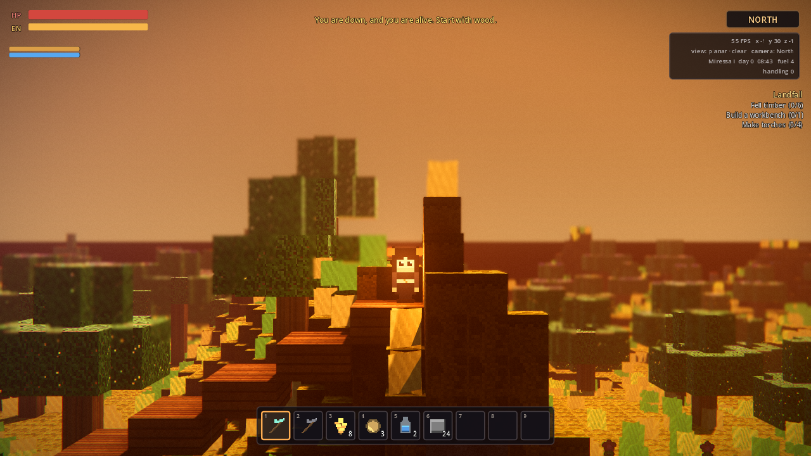

Planar cut on before anything else, because this is the mode I will be building in. It slices the slab in front of me by voxel coordinate rather than by ray, so the wall of the house never comes between me and the course I am laying. It costs nothing per frame while I stand still — the cut set is quantised to the block I am standing in, so it only rebuilds when I cross a boundary.

> day 0, 08:43 · standing at -1 30 -1 · 100 hp · handling 0 · 0 mined, 0 placed, 0 crafted, 0 tamed

## 3. Timber and stone

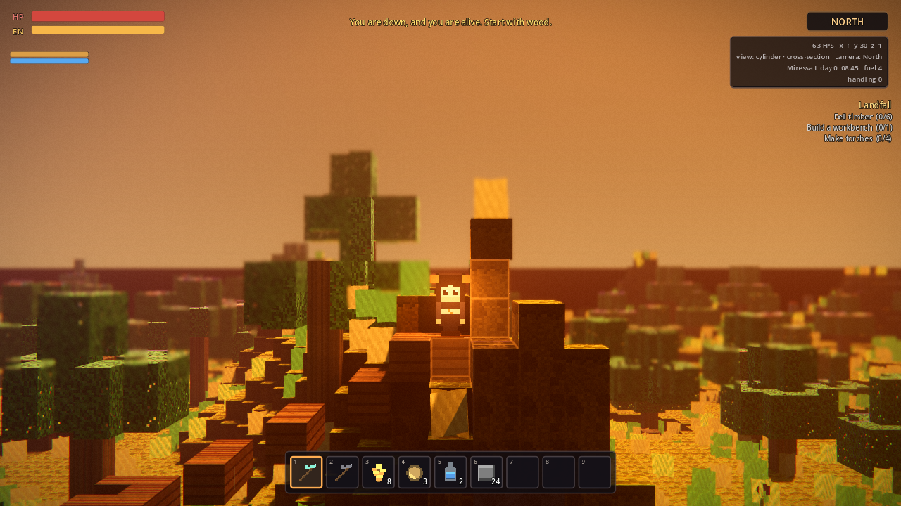

Felled every trunk within forty-six blocks — 36 trunk sections — and took 1043 blocks off the hillside east of the pod. 1223 broken in total. In the chests:

- Cobblestone x162
- Planks x16
- Palm Log x17
- Deepstone x15
- Savannah Soil x863
- Raw Iron x4
- Log x3
- Plant Fibre x67
- Palm Sapling x14

The logs matter more than they look: the first quest asks for them, and trees here are cross-quad billboards, so a trunk is a real column of `tree_log` blocks you swing at rather than scenery you walk through. Cutting one down is the same verb as cutting into a hill.

> day 0, 08:45 · standing at -1 30 -1 · 100 hp · handling 0 · 1223 mined, 0 placed, 0 crafted, 0 tamed

## 4. A workbench, and the rest of the kit

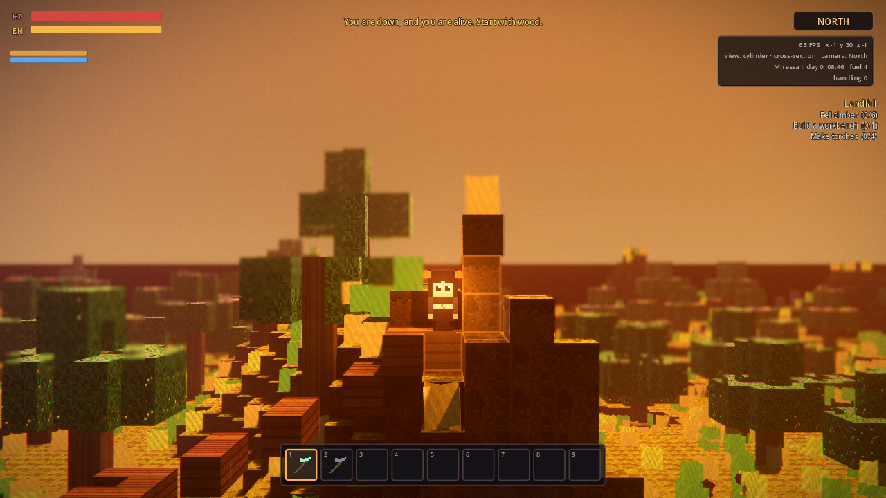

Split the logs at the hand recipe — four boards a log — and fired cobble into brick. **220 planks and 260 brick**, which is a house.

Walls will be Planks, floor Stone Brick — chosen from what the ground actually yielded rather than from a shopping list.

> day 0, 08:46 · standing at -1 30 -1 · 100 hp · handling 0 · 1223 mined, 0 placed, 110 crafted, 0 tamed

## 5. The site, levelled

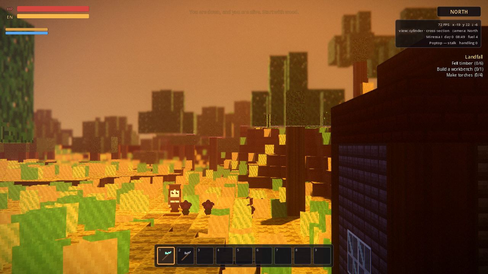

Cleared eleven by nine down to a single course at y=22 and filled the hollows underneath. The ground here falls away to the north, which is why the footings needed the cobble rather than the brick.

> day 0, 08:49 · standing at -19 22 -6 · 100 hp · handling 0 · 1254 mined, 0 placed, 110 crafted, 0 tamed

## 6. The house, from outside

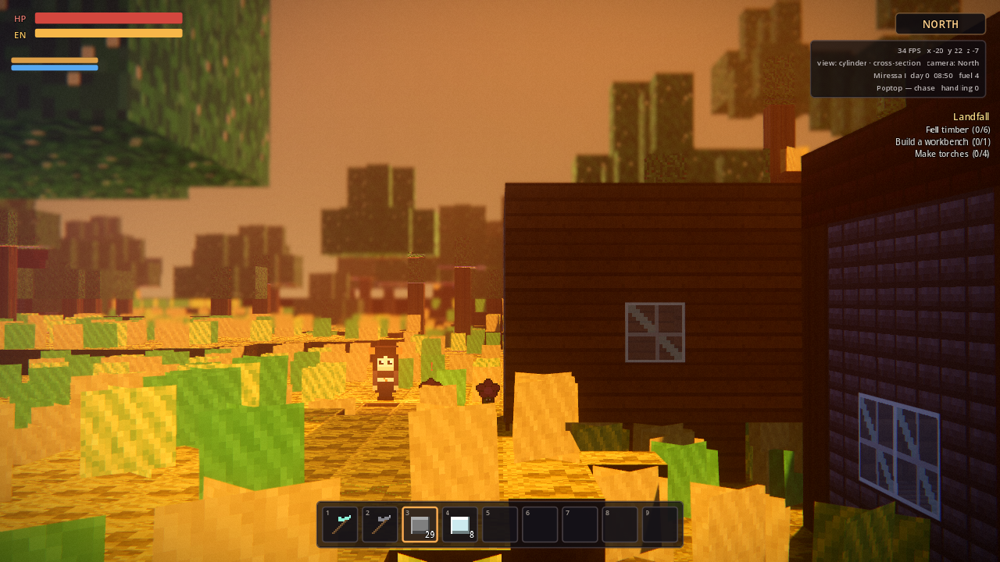

Eleven by nine, four courses of Planks on a raft of Stone Brick, glazed on both long walls, roofed flat. **231 blocks placed so far**, every one of them through the same call the right mouse button makes — which means every one of them came out of the bag and was refused if the cell was occupied or if I was standing in it.

This is not a generated structure. There is a dungeon generator in this build and it was not used.

> day 0, 08:50 · standing at -20 22 -7 · 100 hp · handling 0 · 1254 mined, 231 placed, 145 crafted, 0 tamed

## 7. Inside, with fill cut

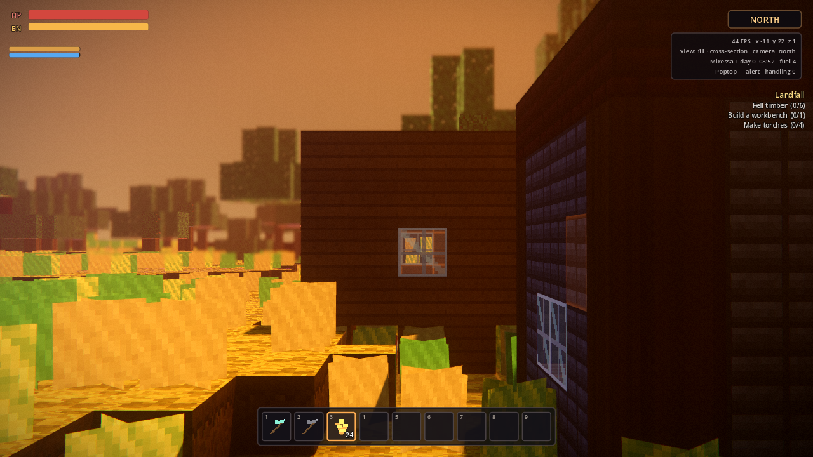

Standing in the middle of it with fill mode on. Fill floods the air pocket I am actually in and cuts everything that stands between that pocket and the lens — so the whole interior opens up at once, roof and near wall and all, and the hillside outside stays exactly where it is. Six stations along the north wall, a bed and two chests along the south, four torches in the corners.

> day 0, 08:52 · standing at -11 22 1 · 100 hp · handling 0 · 1254 mined, 231 placed, 271 crafted, 0 tamed

## 8. The shaft

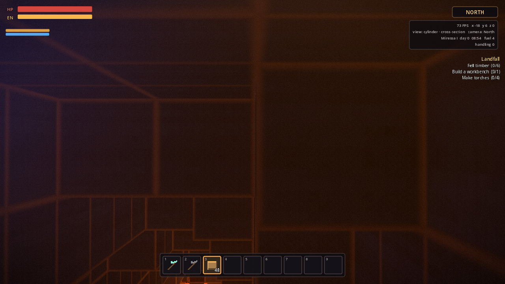

A two-by-two down to y=6, laddered the whole way. 1316 blocks out of the ground so far. The cylinder cut is doing the work here — it always shows the blocks directly below and adjacent, which is the difference between mining and mining blind.

> day 0, 08:54 · standing at -18 6 0 · 100 hp · handling 0 · 1316 mined, 247 placed, 288 crafted, 0 tamed

## 9. The seams

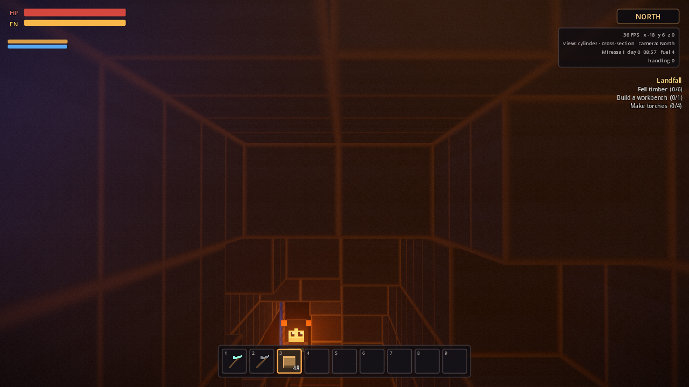

Worked three horizons out of the shaft bottom and took 172 veins. What came up:

| ore | blocks |
| --- | --- |
| silicon ore | 19 |
| tungsten ore | 18 |
| ruby ore | 60 |
| durasteel ore | 51 |
| plutonium ore | 115 |
| amethyst ore | 21 |
| diamond ore | 45 |
| ferozium ore | 11 |
| aegisalt ore | 37 |
| titanium ore | 82 |
| rubium ore | 6 |
| core fragment ore | 49 |
| uranium ore | 60 |
| sapphire ore | 43 |
| silver ore | 12 |
| salt deposit | 54 |
| gold ore | 66 |
| copper ore | 52 |
| crystal ore | 1 |
| iron ore | 34 |

5521 blocks broken all told. Smelted stock in hand: Diamond x45, Crystal Shard x2, Core Fragment x97.

> day 0, 08:57 · standing at -18 6 0 · 100 hp · handling 0 · 5521 mined, 247 placed, 288 crafted, 0 tamed

## 10. Every recipe in the book

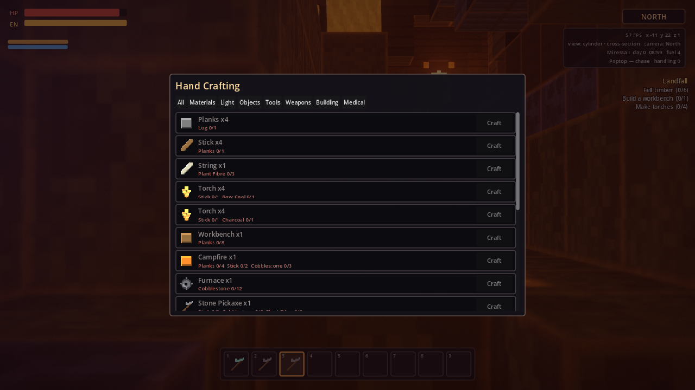

Ran the whole recipe book with each recipe resolved through its own dependency tree: **282 of 285 recipes made**, 2837 crafts performed, every one through `Crafting.craft` with its real inputs spent out of the bag.

The rule I held to: anything with a recipe of its own had to be *made*, not granted. Ore that had to be smelted was smelted, planks were split from logs, bars were drawn at the furnace and taken to the anvil, and the circuit board in the dart rifle traces back through the assembler to copper I dug out of the shaft.

**66 kinds of thing were found rather than made** — the leaves of that tree: ore this planet does not carry, boss drops, vendor stock. Listing them is the only honest way to make the figure above mean anything:

Raw Hide x34, Obsidian x4, Raw Silicon x141, Crystal Shard x117, Raw Gold x148, Raw Copper x187, chemistry set x1, kitchen counter x1, Star Dust x3, Cobblestone x110, Stone x3, Honey x2, Egg x1, Glass Shard x4, Obsidian Shard x12, Starlight Essence x1, Cosmic Dust x4, Quantum Processor x2, Feather x3, Resin x1, Tree Sap x2, Quartz x6, Saltpetre x1, Currentcorn x2, Cotton Wool x156, Potato x3, Emerald x1, Prisilite x3, Raw Solarium x78, Tar x12, Raw Violium x74, Raw Ferozium x56, Raw Aegisalt x19, Raw Durasteel x69, Erchius Fuel x6, Raw Platinum x32, Raw Cerulium x2, Raw Silver x74, Alien Cut x1, Tomato x1

Left unmade (3): craft_copper_gun, print_blink, print_depth_sight.

> day 0, 08:59 · standing at -11 22 1 · 92 hp · handling 0 · 5521 mined, 247 placed, 2837 crafted, 0 tamed

## 11. The handler's kit

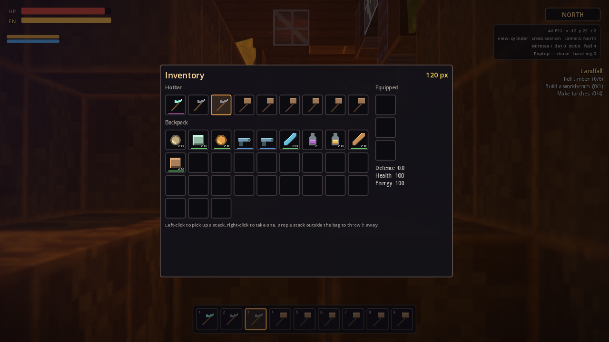

Pulled out of the crafted stock and laid in the bag: a sap club and bolas for the ones that can be handled by force of personality, a dart rifle and darts for the ones that cannot, narcotics to keep them under while they eat, and kibble because it works on everything and halves the work.

The two ends of that kit are deliberate. The club and the bola are hand recipes — three stones and a cord — so nobody is ever locked out of taming on their first afternoon. The rifle needs a circuit board, which needs the assembler, which needs the mine.

> day 0, 09:00 · standing at -12 22 2 · 92 hp · handling 0 · 5521 mined, 247 placed, 4120 crafted, 0 tamed

## 12. The paddock

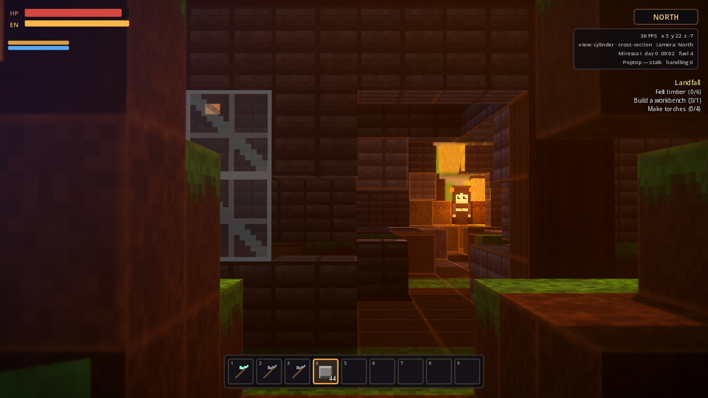

Fourteen by twelve, three courses of Stone Brick, no gate. It exists because a tame that has not learnt obedience wanders off, and because most of what lives here will not be handled in the open.

What this planet's roster actually demands before it can be tamed:

- **Yokat** wants approached while crouched
- **Snaunt** wants tamed after dark
- **Lumoth** wants tamed away from any light
- **Oculob** wants tamed away from any light
- **Batong** wants tamed after dark; approached while crouched

Every one of those is checked at the moment of the attempt, and the creature says which one is missing rather than simply refusing.

> day 0, 09:02 · standing at 3 22 -7 · 92 hp · handling 0 · 5755 mined, 395 placed, 4139 crafted, 0 tamed

## 13. One of each

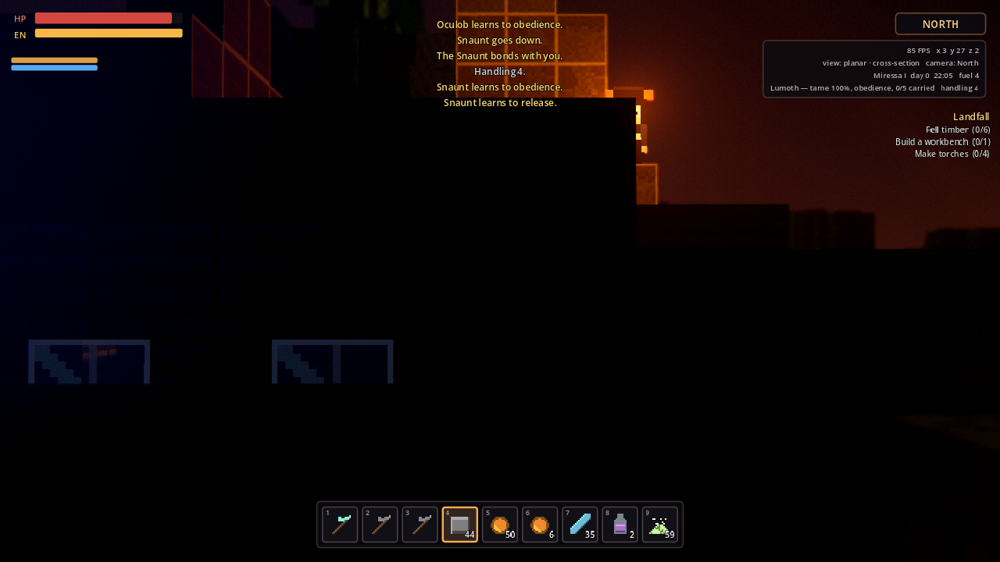

**6 of 6** species on this planet, tamed.

- **Poptop** (wildness 20%, passive, 4 attempts). 95% effective, bonded, knows haul/obedience.
- **Lumoth** (wildness 25%, passive, 1 attempts) — roofed over and doused the lights. 100% effective, knows obedience.
- **Yokat** (wildness 35%, passive, 2 attempts) — crouched. 95% effective, bonded, knows haul/obedience.
- **Batong** (wildness 45%, passive, 1 attempts) — waited for dark, crouched. 90% effective, knows obedience.
- **Oculob** (wildness 52%, knockout, 4 darts, 2 feeds) — roofed over and doused the lights. 100% effective, bonded, knows obedience.
- **Snaunt** (wildness 57%, knockout, 5 darts, 3 feeds) — waited for dark. 100% effective, bonded, knows obedience/release.

Two different games got played there. The calm ones went the RimWorld way: hold out food, roll `(4%% + 3%% × handling) × 2 × (1 − wildness)`, and accept that a failure costs a long cooldown and sometimes a bite. The rest went the Ark way: torpor until they dropped, then food into their own bags while they slept, narcotics to hold them under, and a taming effectiveness that fell every time I hit one harder than I meant to.

Handling ended at **4**, reached by working 15 practice animals before starting on the roster proper and letting each of them go again. That was not optional: the wildest creature here sets a minimum handling level of 4, and a handler below it is turned away at the first attempt with a message saying exactly why.

> day 0, 22:05 · standing at 3 27 2 · 92 hp · handling 4 · 5755 mined, 420 placed, 4139 crafted, 6 tamed

## 14. The hexagram, excavated

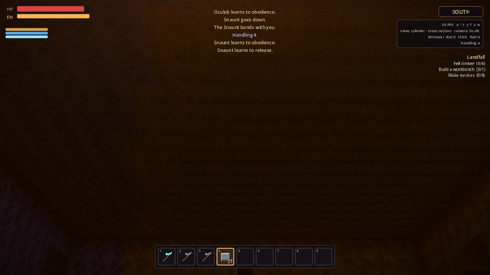

Two overlapping equilateral triangles of radius 9, **standing upright in the x/y plane** and extruded 6 blocks through z. **141 cells in the face, 17290 blocks removed in the session so far.**

Upright, not flat, and that is the whole reason it is worth digging. The camera in this engine is a side-on lens locked to four facings; a star rasterised across the ground plane would be a floor plan, and from a side view a floor plan is a stack of horizontal bands that reads as nothing. Cut into the vertical plane it faces the lens square on.

A gallery twenty-two blocks deep was hollowed out in front of it to stand back in, and that turned out to matter more than any cutaway trick. Fill mode floods the air pocket the player is standing in and strips everything between that pocket and the lens; with the lens twenty blocks back inside a hillside, that is most of the hillside, and the frame fills with removed terrain instead of with the star. Give the camera real air to sit in and the ordinary cylinder cut has nothing left to do — which is the honest lesson of this chamber: the cutaway is for seeing past rock you have not dug, not a substitute for digging.

> day 0, 12:03 · standing at -11 7 -4 · 92 hp · handling 4 · 17290 mined, 1108 placed, 4291 crafted, 6 tamed

## 15. Dressed

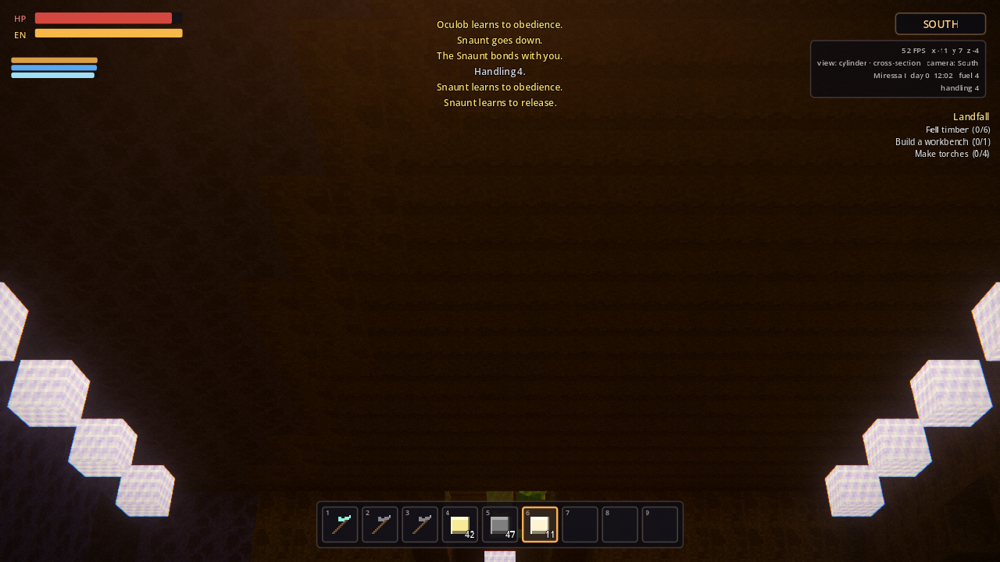

The face itself built out of **Glowstone** across all 141 cells — a star that is its own light source — rimmed in **Blue Crystal** through the full depth, a column of **Obsidian** down each of the six points, and **53 Star Lamp** on a three-block grid, and along the gallery. **395 blocks laid in alone**, 1503 over the run.

Building the face out of light rather than out of stone was not a flourish. Twenty blocks under a hillside there is no ambient light whatsoever, and a hexagram in solarium is a hexagram nobody can see.

It is still not enough. The frame above shows the gallery and the lamps down its corners; the face at the far end of it does not carry across thirty blocks of unlit air, and no amount of moving the camera fixed that. The appendix at the end of this journal reads the shape back out of the voxel data instead, which is the honest way to show something the renderer will not.

> day 0, 12:02 · standing at -11 7 -4 · 92 hp · handling 4 · 17952 mined, 1503 placed, 4471 crafted, 6 tamed

## 16. The same room, turned ninety degrees

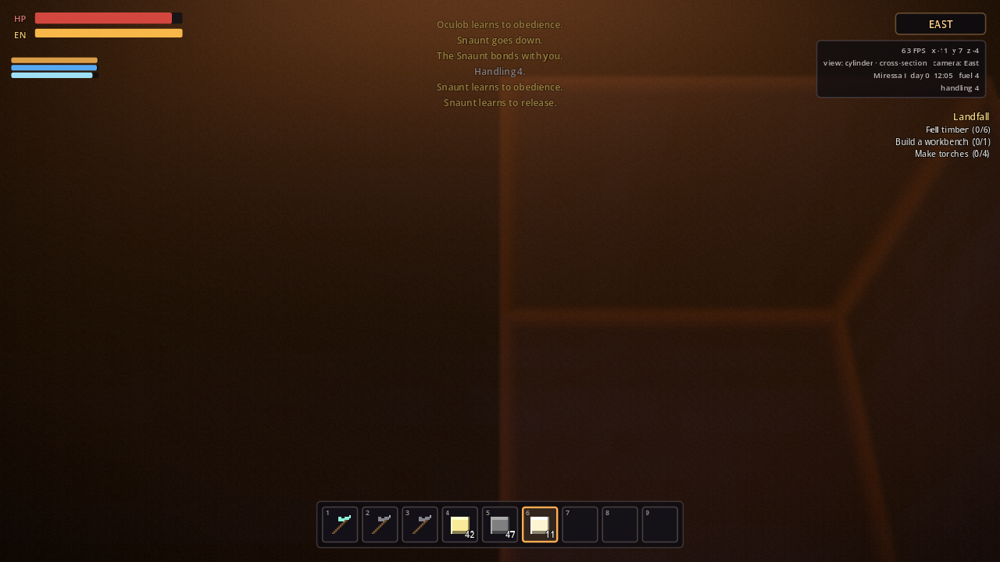

Same chamber, camera rotated ninety degrees. The cut is rebuilt against the new facing — quantised to four directions, so a turn costs one rebuild and not one per frame — and what was the face is now the edge, six blocks deep. The star was cut by voxel coordinate rather than by sightline, so it is a real object in the rock and not a trick of one viewing angle.

> day 0, 12:05 · standing at -11 7 -4 · 92 hp · handling 4 · 17952 mined, 1503 placed, 4471 crafted, 6 tamed

## 17. Everything, in the room it was dug for

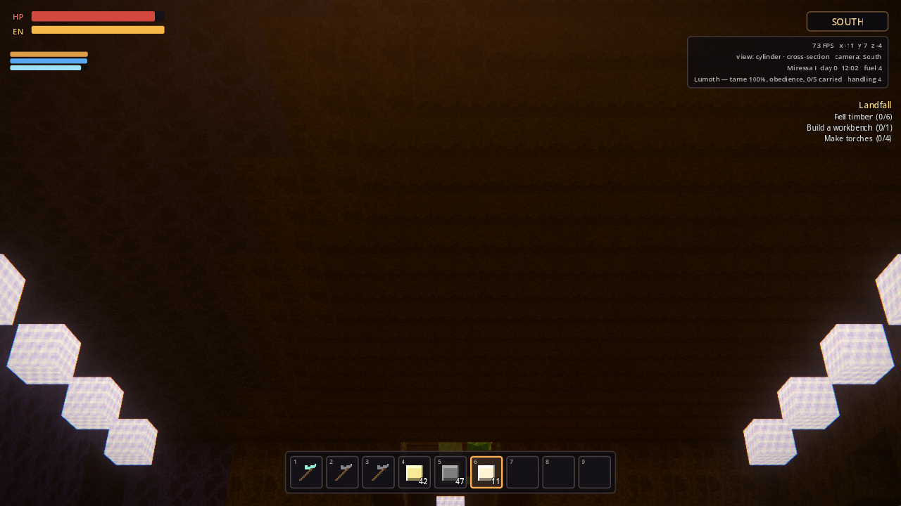

**6 tamed creatures** standing inside an upright hexagram 18 blocks across, 15 blocks under the floor of a house that was placed one block at a time: Batong, Lumoth, Oculob, Poptop, Snaunt, Yokat.

### The tally

| | |
| --- | --- |
| blocks mined | 17952 |
| blocks placed | 1503 |
| distinct recipes made | 282 of 285 |
| crafts performed | 4471 |
| species tamed | 6 of 6 |
| hexagram cells | 141 |
| handling skill | 4 |

Task complete.

> day 0, 12:02 · standing at -11 7 -4 · 92 hp · handling 4 · 17952 mined, 1503 placed, 4471 crafted, 6 tamed

## Appendix: what is actually in the ground

The underground photography above is the weakest part of this journal. A cavity thirty blocks under a hillside has no light in it but what you carry down, and the frames end up showing the gallery and its lamps rather than the face at the far end of it.

So here is the face read straight back out of the voxel data instead — every block of the plate at z=5, `##` for glowstone and `::` for anything else:

```
::::::::::::::::  ##  ::::::::::::::::
::::  ::::::::    ##    ::::::::::::::
    ::  ::::::  ######  ::::::::::::::
    ::  ::::    ######    ::::::::::::
  ::::::::::::##########            ::
::::##############################  ::
::::::##########################    ::
::  ::##########################  ::::
::::::::######################::::::::
::::::::######################::::    
::::::::######################::::::::
::::::##########################::::::
::::::##########################::::::
::::##############################::::
::::::::::::::##########::::      ::::
::::::::::::    ####::::::::::::::::::
::::::::::::::  ####::::::::::::::::::
::::::::::::::::::##::::::::::::::::::
::::::::::::::::::##::::::::::::::::::
```

**322 blocks in the face**, across 19 columns and 19 rows: Blue Crystal x25, Glowstone x139, Mantle Stone x11, Deepstone x21, Corestone x60, Savannah Soil x17, Water x27, Dirt x22.
